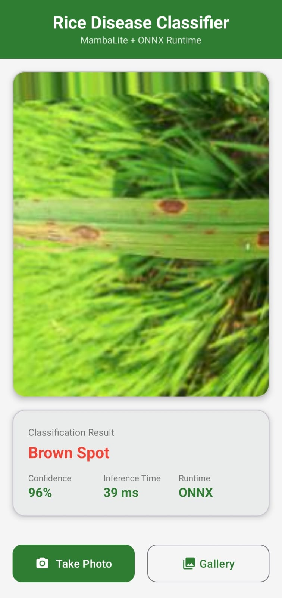

# Rice Disease Classification

A deep learning approach for detecting diseases in rice leaves, optimized for edge deployment.

## Project Overview

This project explores different model architectures for classifying rice leaf diseases into 6 categories:
- Bacterial Leaf Blight
- Brown Spot
- Healthy Rice Leaf
- Leaf Blast
- Leaf Scald
- Sheath Blight

**Objective:** Develop a highly accurate model under strict size constraints (<5MB, bonus <1MB) for deployment on resource-constrained edge devices.

## Approach

### Phase 1: Baseline with YOLOv11

Initially, I fine-tuned **YOLOv11n-cls** (nano classification variant) as the baseline model. While achieving good accuracy (~97.93%), the model size (~3.1 MB PyTorch, ~5.9 MB ONNX) exceeded the 1MB bonus target.

### Phase 2: Custom MambaCNN Architecture (Edge Model)

To achieve sub-1MB model size while maintaining accuracy, I designed a custom architecture combining:

1. **CNN Stem**: 4-layer convolutional backbone for spatial feature extraction
2. **Mamba S6 Blocks**: State-space model blocks that efficiently capture sequential dependencies in the flattened feature maps

**Architecture Flow:**
```
Input (128x128x3) → CNN Stem → Patchify → Mamba Blocks → Global Pool → Classification
```

The Mamba architecture leverages selective state spaces to model long-range dependencies with linear complexity, making it highly parameter-efficient compared to transformers.

### Why Accuracy Remained High Despite Smaller Model Size?

The MambaCNN achieved **98.44% accuracy** with only **649 KB** model size. This can be attributed to:

1. **Efficient Feature Learning**: The CNN stem extracts hierarchical spatial features effectively in just 4 blocks, while Mamba blocks capture global context efficiently through state-space modeling.

2. **Task Complexity vs Model Capacity**: The rice disease classification task (6 classes, ~3800 images) has distinguishable visual patterns (spots, blight patterns, color changes). A well-designed compact model can learn these discriminative features without requiring millions of parameters.

3. **Mamba's Parameter Efficiency**: Unlike attention mechanisms that scale quadratically, Mamba's selective scan operates in linear complexity. The state-space formulation compresses information efficiently through learned A, B, C, D matrices.

4. **Appropriate Bottleneck Design**: With `d_model=64` and `n_mamba=2`, the model has sufficient representational capacity for this dataset. Larger models would likely overfit rather than improve generalization.

5. **Strong Regularization**: Dropout (0.5), label smoothing (0.05), and early stopping prevent overfitting, allowing the compact model to generalize well.

## Trade-off Analysis

| Metric | Baseline (YOLO) | Edge (MambaCNN Lite) |
|--------|-----------------|----------------------|
| **File Size (PyTorch)** | 3.1 MB | 0.63 MB |
| **File Size (ONNX)** | 5.9 MB | 1.3 MB |
| **Test Accuracy** | 97.93% | 98.44% |
| **Mean Accuracy (6 seeds)** | 97.30% (±0.64%) | 97.92% (±0.33%) |
| **Input Resolution** | 320×320 | 128×128 |
| **Inference Speed (CPU)** | 31.40 ms | 8.44 ms |
| **Parameters** | ~1.5M | ~165K |

**Inference Benchmark Hardware:** Apple M1 CPU (8GB RAM), single image inference

**Training Hardware:** Kaggle T4 GPU

## Android App

A mobile application for real-time rice disease classification using ONNX Runtime.

### Demo Screenshot

<p align="center">
  
</p>

**App Features:**
- Camera capture and gallery selection
- Real-time inference using ONNX Runtime
- Displays disease name, confidence score, and inference time
- Runs entirely on-device (no internet required)

### Download & Install

**Pre-built APK:** [app.apk](app.apk) (~70 MB debug build)

To install:
1. Download `app.apk` to your Android phone
2. Enable "Install from unknown sources" in Settings
3. Open the APK file to install

### Build from Source

```bash
cd RiceDiseaseClassifier

# Build debug APK
./gradlew assembleDebug

# APK location: app/build/outputs/apk/debug/app-debug.apk
```

Or open `RiceDiseaseClassifier` in Android Studio and click Run.

### Re-export Model for Android

If you need to re-export the ONNX model with Android-compatible IR version:

```bash
python export_model_android.py
```

This exports the model with opset 14 (IR version 7), compatible with ONNX Runtime Android.

---

## Repository Structure

```
Rice_Disease_classification/
├── README.md                      # This file
├── requirements.txt               # Python dependencies
├── predict.py                     # Standalone inference script
├── export_model_android.py        # ONNX export script for Android
├── app.apk                        # Pre-built Android app
├── test.jpeg                      # App demo screenshot
│
├── RiceDiseaseClassifier/            # Android app source code
│   ├── README.md                  # App documentation
│   ├── app/src/main/
│   │   ├── assets/mamba_lite.onnx
│   │   ├── java/.../MainActivity.kt
│   │   └── java/.../RiceClassifier.kt
│   └── build.gradle.kts
│
├── train-mamba.ipynb              # MambaCNN training notebook
├── mamba-lite.ipynb               # MambaCNN lite variant training
├── train-yolo.ipynb               # YOLOv11 training notebook
│
├── train_mamba_results/           # MambaCNN training outputs
│   └── outputs/
│       ├── mamba_cnn_summary.json
│       ├── mamba_cnn_seed_results.csv
│       ├── all_seed_results.json
│       ├── mamba_cnn_best_confusion_matrix.png
│       └── runs/seed_*/           # Per-seed checkpoints (.pth, .onnx)
│
├── train_mamba_lite_results/      # MambaCNN Lite outputs (same structure)
│   └── outputs/
│       ├── mamba_cnn_summary.json
│       ├── mamba_cnn_seed_results.csv
│       ├── all_seed_results.json
│       ├── mamba_cnn_best_confusion_matrix.png
│       └── runs/seed_*/           # Per-seed checkpoints (.pth, .onnx)
│
└── train_yolo_results/            # YOLO training outputs
    ├── yolo11n-cls.pt             # Pretrained YOLO model
    ├── data/splits/               # Train/val/test image splits
    ├── outputs/
    │   ├── best_model/            # Best YOLO weights (.pt, .onnx)
    │   ├── multi_seed_summary.json
    │   ├── seed_results.csv
    │   └── all_seed_results.json
    └── runs/classify/
        ├── outputs/runs/seed_*/   # Per-seed training outputs
        └── val*/                  # Validation results & confusion matrices
```

## Installation

```bash
# Clone the repository
git clone https://github.com/<username>/Rice_Disease_classification.git
cd Rice_Disease_classification

# Create virtual environment (recommended)
python -m venv venv
source venv/bin/activate  # On Windows: venv\Scripts\activate

# Install dependencies
pip install -r requirements.txt
```

## Usage

### Inference with predict.py

The inference script supports three models:

| Model | Command | Description |
|-------|---------|-------------|
| `mamba_lite` | `--model mamba_lite` | Edge model, <1MB (default) |
| `mamba` | `--model mamba` | Original MambaCNN |
| `yolo` | `--model yolo` | YOLO Baseline (~3MB) |

```bash
# Using MambaCNN Lite (Edge model, recommended - default)
python predict.py --image path/to/leaf_image.jpg --model mamba_lite

# Using original MambaCNN
python predict.py --image path/to/leaf_image.jpg --model mamba

# Using YOLO (Baseline model)
python predict.py --image path/to/leaf_image.jpg --model yolo

# Specify custom checkpoint
python predict.py --image leaf.jpg --model mamba_lite --checkpoint path/to/model.pth

# Force CPU inference
python predict.py --image leaf.jpg --model mamba_lite --device cpu
```

### Example Output

```
============================================================
Rice Disease Classification
============================================================
Model:      MAMBA_LITE
Checkpoint: train_mamba_lite_results/outputs/runs/seed_123/best_mamba_cnn_seed123.pth
Device:     cpu
Image:      test_leaf.jpg
============================================================

Prediction:     Sheath_Blight
Confidence:     99.71%
Inference Time: 8.44 ms

All Class Probabilities:
----------------------------------------
  Sheath_Blight              99.71% ###################
  Healthy_Rice_Leaf           0.12%
  Bacterial_Leaf_Blight       0.06%
  Brown_Spot                  0.05%
  Leaf_Blast                  0.05%
  Leaf_scald                  0.01%

============================================================
```

### Inference Speed Comparison

Tested on a sample image (`Sheath Blight/IMG_20231014_173912.jpg`) on Apple M1 CPU:

| Model | Prediction | Confidence | Inference Time |
|-------|------------|------------|----------------|
| **mamba_lite** | Sheath_Blight | 99.71% | **8.44 ms** |
| **mamba** | Sheath_Blight | 99.71% | 9.89 ms |
| **yolo** | Sheath_Blight | 100.00% | 31.40 ms |

MambaCNN Lite is **~4x faster** than YOLO on CPU inference.

## Model Files

### MambaCNN Lite - Edge Model (Recommended for Deployment)
- **Path:** `train_mamba_lite_results/outputs/runs/seed_123/best_mamba_cnn_seed123.pth`
- **Size:** 649 KB
- **Accuracy:** 98.44%
- **Inference:** 8.44 ms (CPU)

### MambaCNN - Original
- **Path:** `train_mamba_results/outputs/runs/seed_123/best_mamba_cnn_seed123.pth`
- **Size:** 649 KB
- **Accuracy:** 98.44%
- **Inference:** 9.89 ms (CPU)

### YOLOv11 - Baseline Model
- **Path:** `train_yolo_results/outputs/best_model/best.pt`
- **Size:** 3.1 MB
- **Accuracy:** 97.93%
- **Inference:** 31.40 ms (CPU)

## Training

Training was performed on Kaggle with T4 GPU. To reproduce:

1. Upload the notebooks to Kaggle
2. Add the [Rice Disease Dataset](https://www.kaggle.com/datasets/anshulm257/rice-disease-dataset) as input
3. Enable GPU accelerator (T4)
4. Run all cells

**Training Configuration (MambaCNN):**
- Epochs: 80 (with early stopping, patience=20)
- Batch Size: 64
- Learning Rate: 2e-3 (cosine annealing)
- Optimizer: AdamW (weight_decay=0.05)
- Seeds Tested: [1, 42, 123, 456, 789, 1024]

**Training Configuration (YOLO):**
- Epochs: 150 (with early stopping, patience=25)
- Batch Size: 32
- Learning Rate: 1e-3 (cosine schedule)
- Model: YOLOv11n-cls (nano)
- Seeds Tested: [1, 42, 123, 456, 789, 1024]

## Dataset

- **Source:** [Rice Disease Dataset](https://www.kaggle.com/datasets/anshulm257/rice-disease-dataset)
- **Total Images:** 3,829
- **Split:** 70% train / 15% validation / 15% test
- **Classes:** 6 rice disease categories

## Results Summary

### MambaCNN (Edge Model)
| Seed | Test Accuracy | Test Loss |
|------|---------------|-----------|
| 123  | **98.44%**    | 0.3228    |
| 42   | 97.92%        | 0.3399    |
| 789  | 97.92%        | 0.3236    |
| 456  | 97.92%        | 0.3365    |
| 1024 | 97.92%        | 0.3259    |
| 1    | 97.40%        | 0.3392    |

**Mean: 97.92% (±0.33%)**

### YOLOv11 (Baseline)
| Seed | Top-1 Accuracy | Top-5 Accuracy |
|------|----------------|----------------|
| 789  | **97.93%**     | 100.0%         |
| 1024 | 97.93%         | 100.0%         |
| 123  | 97.76%         | 99.83%         |
| 42   | 96.90%         | 100.0%         |
| 456  | 96.72%         | 100.0%         |
| 1    | 96.55%         | 100.0%         |

**Mean: 97.30% (±0.64%)**

## Key Findings

1. **MambaCNN outperforms YOLO** on this dataset while being **5x smaller** in model size.

2. **Consistency**: MambaCNN shows lower variance across seeds (±0.33%) compared to YOLO (±0.64%), indicating more stable training.

3. **Edge-Ready**: The MambaCNN model at 649 KB easily meets the <1MB constraint while achieving state-of-the-art accuracy on this dataset.

4. **Inference Efficiency**: Smaller input size (128×128 vs 320×320) and fewer parameters result in faster inference on CPU.

## License

This project is for educational purposes.

## Acknowledgments

- Dataset: [Rice Disease Dataset](https://www.kaggle.com/datasets/anshulm257/rice-disease-dataset) by Anshul M.
- Mamba Architecture: Inspired by [Mamba: Linear-Time Sequence Modeling with Selective State Spaces](https://arxiv.org/abs/2312.00752)
- YOLO: [Ultralytics YOLOv11](https://docs.ultralytics.com/)
